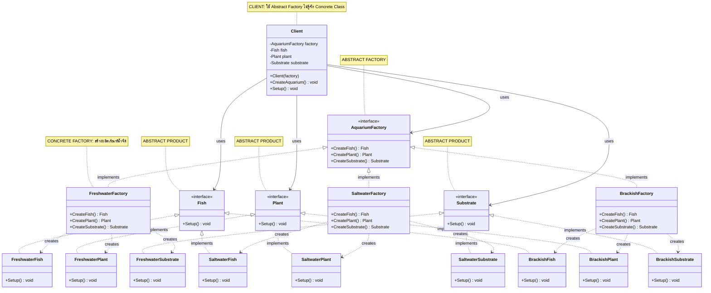

# Abstract Factory Pattern - Aquarium System

## 📋 ภาพรวม
โปรเจกต์นี้สาธิต **Abstract Factory Pattern** โดยใช้ตัวอย่างระบบตู้ปลาที่รองรับน้ำ 3 ประเภท (น้ำจืด, น้ำเค็ม, น้ำกร่อย)

Abstract Factory Pattern ให้ interface สำหรับสร้างกลุ่มของ objects ที่เกี่ยวข้องกัน โดยไม่ต้องระบุ concrete class

---

## 🏗️ Class Diagram



---

## 🎯 Abstract Factory Pattern Components

### 1️⃣ **Abstract Product** (ผลิตภัณฑ์นามธรรม)
Interface ที่กำหนดประเภทของผลิตภัณฑ์แต่ละชนิด

#### 🐟 Fish (interface)
- `Setup()` - ติดตั้งปลาลงตู้

#### 🌿 Plant (interface)
- `Setup()` - ติดตั้งพืชลงตู้

#### 🪨 Substrate (interface)
- `Setup()` - ติดตั้งรองพื้นตู้ปลา

---

### 2️⃣ **Concrete Product** (ผลิตภัณฑ์จริง)
Implementation ของ Abstract Product แต่ละประเภท **จัดกลุ่มตามตระกูล (family)**

#### 🟦 ตระกูลน้ำจืด (Freshwater Family)
- **FreshwaterFish** - ปลาน้ำจืด
- **FreshwaterPlant** - พืชน้ำจืด
- **FreshwaterSubstrate** - รองพื้นสำหรับน้ำจืด

#### 🟩 ตระกูลน้ำเค็ม (Saltwater Family)
- **SaltwaterFish** - ปลาน้ำเค็ม
- **SaltwaterPlant** - พืชน้ำเค็ม (สาหร่าย, ปะการัง)
- **SaltwaterSubstrate** - รองพื้นสำหรับน้ำเค็ม

#### 🟨 ตระกอลน้ำกร่อย (Brackish Family)
- **BrackishFish** - ปลาน้ำกร่อย
- **BrackishPlant** - พืชน้ำกร่อย
- **BrackishSubstrate** - รองพื้นสำหรับน้ำกร่อย

**หลักการสำคัญ:** Products ในแต่ละตระกูลถูกออกแบบให้ทำงานร่วมกันได้ดี (ปลาน้ำจืดไม่ควรอยู่กับพืชน้ำเค็ม)

---

### 3️⃣ **Abstract Factory** (โรงงานนามธรรม)

#### 🏭 AquariumFactory (interface)
- `CreateFish()` - สร้างปลา
- `CreatePlant()` - สร้างพืช
- `CreateSubstrate()` - สร้างรองพื้น

กำหนด interface สำหรับสร้าง **กลุ่มของ related products**

---

### 4️⃣ **Concrete Factory** (โรงงานจริง)
แต่ละโรงงานสร้างผลิตภัณฑ์ใน **ตระกูลเดียวกัน**

#### 🏭 FreshwaterFactory
```csharp
CreateFish()      → new FreshwaterFish()
CreatePlant()     → new FreshwaterPlant()
CreateSubstrate() → new FreshwaterSubstrate()
```
สร้างชุดอุปกรณ์ตู้ปลาน้ำจืดครบชุด

#### 🏭 SaltwaterFactory
```csharp
CreateFish()      → new SaltwaterFish()
CreatePlant()     → new SaltwaterPlant()
CreateSubstrate() → new SaltwaterSubstrate()
```
สร้างชุดอุปกรณ์ตู้ปลาน้ำเค็มครบชุด

#### 🏭 BrackishFactory
```csharp
CreateFish()      → new BrackishFish()
CreatePlant()     → new BrackishPlant()
CreateSubstrate() → new BrackishSubstrate()
```
สร้างชุดอุปกรณ์ตู้ปลาน้ำกร่อยครบชุด

---

### 5️⃣ **Client** (ผู้ใช้งาน)

#### 👤 Client Class
- ทำงานกับ **Abstract Factory** และ **Abstract Products** เท่านั้น
- **ไม่รู้จัก** Concrete Classes (FreshwaterFish, SaltwaterFactory, etc.)
- รับ Factory ผ่าน constructor (Dependency Injection)
- เรียก `CreateAquarium()` เพื่อสร้างผลิตภัณฑ์ทั้งหมด
- เรียก `Setup()` เพื่อติดตั้งตู้ปลา

```csharp
public Client(AquariumFactory f)
{
    factory = f;  // ไม่รู้ว่าเป็น Factory ชนิดไหน
    CreateAquarium();
}
```

---

## ✅ ข้อดีของ Abstract Factory Pattern

### 1. **🔒 Consistency (ความสอดคล้อง)**
- รับประกันว่าผลิตภัณฑ์ที่สร้างมาจะอยู่ใน **family เดียวกัน**
- ไม่มีทางผสม SaltwaterFish กับ FreshwaterPlant ได้

### 2. **🔓 Loose Coupling**
- Client ไม่ขึ้นกับ Concrete Classes
- เปลี่ยน product family ได้ง่ายโดยเปลี่ยนแค่ Factory

### 3. **📦 Single Responsibility**
- แยกการสร้าง objects ออกจาก business logic
- แต่ละ Factory รับผิดชอบแค่ product family ของตัวเอง

### 4. **✨ Open/Closed Principle**
- เพิ่ม product family ใหม่ได้โดยไม่แก้โค้ดเดิม
- เพียงสร้าง Concrete Factory ใหม่

### 5. **🎨 Separation of Concerns**
- Product: กำหนดพฤติกรรม
- Factory: จัดการการสร้าง
- Client: ใช้งาน

---

## 🎮 วิธีใช้งาน

### แบบใช้ Client Class (แนะนำ)
```csharp
// เปลี่ยน product family ง่ายๆ โดยเปลี่ยน Factory
AquariumFactory factory;
Client client;

// น้ำจืด
factory = new FreshwaterFactory();
client = new Client(factory);
client.Setup();

// น้ำเค็ม
factory = new SaltwaterFactory();
client = new Client(factory);
client.Setup();

// น้ำกร่อย
factory = new BrackishFactory();
client = new Client(factory);
client.Setup();
```

### แบบ Manual (ไม่แนะนำ)
```csharp
AquariumFactory factory = new FreshwaterFactory();
Fish fish = factory.CreateFish();
Plant plant = factory.CreatePlant();
Substrate substrate = factory.CreateSubstrate();

fish.Setup();
plant.Setup();
substrate.Setup();
```

---

## 🆚 เปรียบเทียบกับ Factory Method

| Feature | Factory Method | Abstract Factory |
|---------|---------------|------------------|
| จุดประสงค์ | สร้าง **1 product** | สร้าง **กลุ่มของ related products** |
| Complexity | ง่ายกว่า | ซับซ้อนกว่า |
| Product Families | ไม่มี | มี (Freshwater, Saltwater, Brackish) |
| Use Case | ต้องการ polymorphism ในการสร้าง object | ต้องการความสอดคล้องระหว่าง products |
| ตัวอย่าง | สร้าง Fish เท่านั้น | สร้าง Fish + Plant + Substrate |

---

## 🔮 การขยายในอนาคต

หากต้องการเพิ่ม product family ใหม่ เช่น **Tropical (เขตร้อน)**:

### 1. สร้าง Concrete Products
```csharp
public class TropicalFish : Fish
{
    public void Setup() { Console.WriteLine("ใส่ปลาเขตร้อนแล้ว"); }
}

public class TropicalPlant : Plant
{
    public void Setup() { Console.WriteLine("ใส่พืชเขตร้อนแล้ว"); }
}

public class TropicalSubstrate : Substrate
{
    public void Setup() { Console.WriteLine("ใส่รองพื้นสำหรับปลาเขตร้อนแล้ว"); }
}
```

### 2. สร้าง Concrete Factory
```csharp
public class TropicalFactory : AquariumFactory
{
    public Fish CreateFish() => new TropicalFish();
    public Plant CreatePlant() => new TropicalPlant();
    public Substrate CreateSubstrate() => new TropicalSubstrate();
}
```

### 3. ใช้งานได้ทันที
```csharp
factory = new TropicalFactory();
client = new Client(factory);
client.Setup();
```

**ไม่ต้องแก้:**
- ❌ Client class
- ❌ Abstract Factory interface
- ❌ Abstract Product interfaces
- ❌ Product families อื่นๆ

---

## 🎯 เมื่อไหร่ควรใช้ Abstract Factory?

### ✅ ใช้เมื่อ:
1. ระบบต้องทำงานกับ **several families of related products**
2. ต้องการ **enforce consistency** ระหว่าง products
3. ต้องการ **hide concrete classes** จาก client
4. Product families มีแนวโน้มที่จะ**ขยายในอนาคต**

### ❌ ไม่ควรใช้เมื่อ:
1. มี product แค่ชนิดเดียว → ใช้ **Factory Method** แทน
2. ไม่มี product families → ใช้ **Simple Factory** แทน
3. ความซับซ้อนมากเกินความจำเป็น → ใช้ **Direct Instantiation**

---

## 📊 สรุป

โปรเจกต์นี้แสดงให้เห็นถึง **Abstract Factory Pattern** ที่:
- ✅ ครบทุก component (Abstract Product, Concrete Product, Abstract Factory, Concrete Factory, Client)
- ✅ รองรับหลาย product families (Freshwater, Saltwater, Brackish)
- ✅ รับประกัน **product consistency** ภายใน family
- ✅ ง่ายต่อการขยาย product families ใหม่
- ✅ Client ไม่ขึ้นกับ concrete classes

Pattern นี้เหมาะกับระบบที่มีผลิตภัณฑ์หลายชนิดที่ต้องทำงานร่วมกันเป็นชุด และต้องการความยืดหยุ่นในการเปลี่ยน product family ทั้งชุดพร้อมกัน! 🎨🐠
