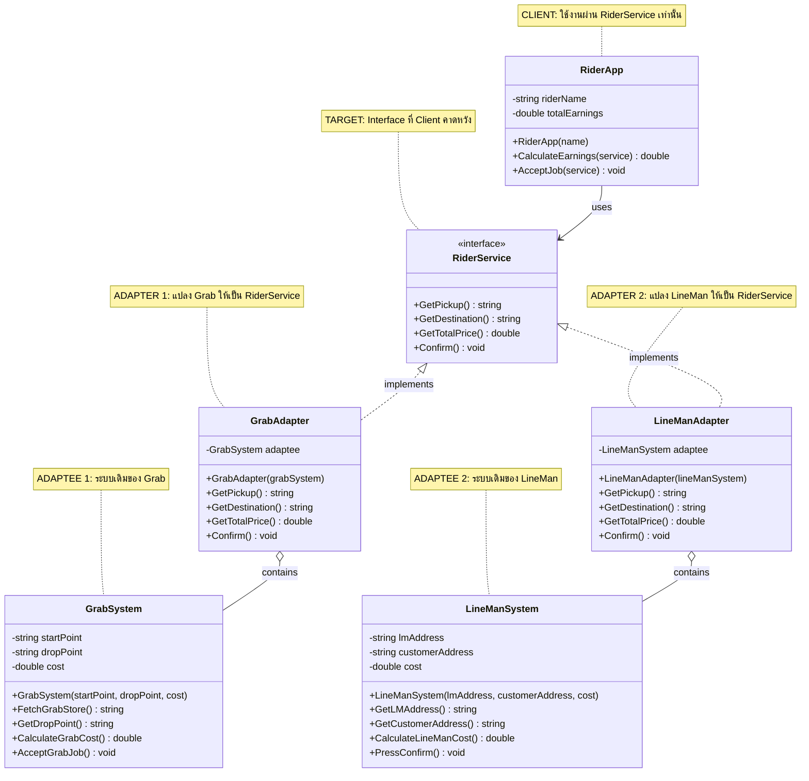

# Adapter Pattern - Rider Service System

## 📋 ภาพรวม
โปรเจกต์นี้สาธิต **Adapter Pattern** โดยใช้ตัวอย่างระบบไรเดอร์ที่รองรับหลาย platform (Grab และ LineMan)

Adapter Pattern ช่วยให้ระบบที่มี interface ไม่ตรงกันสามารถทำงานร่วมกันได้ โดยไม่ต้องแก้ไขโค้ดเดิม

---

## 🏗️ Class Diagram



---

## 🎯 Adapter Pattern Components

### 1️⃣ **Target** (Interface ที่ Client ต้องการ)
- **`RiderService`** (interface)
  - Interface มาตรฐานที่ Client คาดหวัง
  - กำหนด contract สำหรับการรับ-ส่งงาน
  - Methods:
    - `GetPickup()` - รับจุดรับสินค้า
    - `GetDestination()` - รับจุดส่งสินค้า
    - `GetTotalPrice()` - คำนวณราคา
    - `Confirm()` - ยืนยันรับงาน

---

### 2️⃣ **Adaptee** (ระบบเดิมที่มี Interface ต่างกัน)

#### 🟢 GrabSystem
- ระบบของ Grab ที่มี method names เฉพาะตัว
- Methods:
  - `FetchGrabStore()` ❌ ไม่ตรงกับ `GetPickup()`
  - `GetDropPoint()` ❌ ไม่ตรงกับ `GetDestination()`
  - `CalculateGrabCost()` ❌ ไม่ตรงกับ `GetTotalPrice()`
  - `AcceptGrabJob()` ❌ ไม่ตรงกับ `Confirm()`

#### 🔵 LineManSystem
- ระบบของ LineMan ที่มี method names ต่างจาก Grab และ RiderService
- Methods:
  - `GetLMAddress()` ❌ ไม่ตรงกับ `GetPickup()`
  - `GetCustomerAddress()` ❌ ไม่ตรงกับ `GetDestination()`
  - `CalculateLineManCost()` ❌ ไม่ตรงกับ `GetTotalPrice()`
  - `PressConfirm()` ❌ ไม่ตรงกับ `Confirm()`

**ปัญหา:** ทั้ง 2 ระบบไม่สามารถใช้กับ `RiderService` ได้โดยตรง

---

### 3️⃣ **Adapter** (ตัวแปลง/สะพานเชื่อม)

#### 🔄 GrabAdapter
- Implements `RiderService` interface
- มี `GrabSystem` เป็น composition (Object Adapter Pattern)
- แปลง method calls:
  ```
  GetPickup()      → adaptee.FetchGrabStore()
  GetDestination() → adaptee.GetDropPoint()
  GetTotalPrice()  → adaptee.CalculateGrabCost()
  Confirm()        → adaptee.AcceptGrabJob()
  ```

#### 🔄 LineManAdapter
- Implements `RiderService` interface
- มี `LineManSystem` เป็น composition
- แปลง method calls:
  ```
  GetPickup()      → adaptee.GetLMAddress()
  GetDestination() → adaptee.GetCustomerAddress()
  GetTotalPrice()  → adaptee.CalculateLineManCost()
  Confirm()        → adaptee.PressConfirm()
  ```

---

### 4️⃣ **Client** (ผู้ใช้งาน)

#### 👤 RiderApp
- ทำงานผ่าน `RiderService` interface เท่านั้น
- **ไม่รู้** ว่าข้างหลังใช้ระบบอะไร (Grab, LineMan, หรืออื่นๆ)
- ใช้ Polymorphism: `AcceptJob(RiderService service)`
- ติดตามรายได้ของไรเดอร์

---

## ✅ ข้อดีของ Adapter Pattern

1. **🔓 Loose Coupling**
   - Client ไม่ขึ้นกับ implementation ของแต่ละ platform
   - เปลี่ยน platform ได้โดยไม่กระทบ Client

2. **🚀 Extensibility**
   - เพิ่ม platform ใหม่ (เช่น FoodPanda, Lineman Taxi) ได้ง่าย
   - สร้าง Adapter ใหม่โดยไม่แก้โค้ดเดิม

3. **♻️ Reusability**
   - ใช้ `GrabSystem` และ `LineManSystem` เดิมได้
   - ไม่ต้องแก้ไข source code ของระบบเดิม

4. **📦 Single Responsibility**
   - Adaptee: จัดการ business logic
   - Adapter: จัดการการแปลง interface
   - Client: จัดการการใช้งาน

5. **✨ Open/Closed Principle**
   - เปิดรับการขยาย (เพิ่ม Adapter ใหม่)
   - ปิดการแก้ไข (ไม่แก้ Client และ Adaptee)

---

## 🎮 วิธีใช้งาน

### แบบปกติ
```csharp
RiderApp rider = new RiderApp("นราธิป");

// ใช้ Grab
GrabSystem grabData = new GrabSystem("ร้านข้าวมันไก่", "ตึกSCL", 20.0);
RiderService job1 = new GrabAdapter(grabData);
rider.AcceptJob(job1);

// ใช้ LineMan
LineManSystem lineManData = new LineManSystem("เดอะมอลล์", "ตึกวิทย์คอม", 25.0);
RiderService job2 = new LineManAdapter(lineManData);
rider.AcceptJob(job2);
```

### แบบใช้ List (รองรับหลายงาน)
```csharp
RiderApp rider = new RiderApp("สมพง");

List<RiderService> jobList = new List<RiderService>();
jobList.Add(new GrabAdapter(new GrabSystem("ร้านส้มตำ", "ตึกวิทย์คอม", 30.0)));
jobList.Add(new LineManAdapter(new LineManSystem("ฟู้ดคอร์ท", "ห้องสมุดกลาง", 15.0)));

foreach (var job in jobList)
{
    rider.AcceptJob(job);
}
```

---

## 🔮 การขยายในอนาคต

หากต้องการเพิ่ม platform ใหม่ เช่น **FoodPanda**:

```csharp
// 1. สร้าง Adaptee (ระบบของ FoodPanda)
public class FoodPandaSystem
{
    public string GetOrigin() { ... }
    public string GetTarget() { ... }
    public double GetPrice() { ... }
    public void Accept() { ... }
}

// 2. สร้าง Adapter
public class FoodPandaAdapter : RiderService
{
    private FoodPandaSystem adaptee;
    
    public string GetPickup() => adaptee.GetOrigin();
    public string GetDestination() => adaptee.GetTarget();
    public double GetTotalPrice() => adaptee.GetPrice();
    public void Confirm() => adaptee.Accept();
}

// 3. ใช้งานได้ทันที ไม่ต้องแก้ RiderApp
RiderService job = new FoodPandaAdapter(new FoodPandaSystem(...));
rider.AcceptJob(job);
```

---

## 📊 สรุป

โปรเจกต์นี้แสดงให้เห็นถึง **Object Adapter Pattern** ที่:
- ✅ ครบทุก component (Target, Adaptee, Adapter, Client)
- ✅ ใช้ Composition แทน Inheritance (มีความยืดหยุ่นสูง)
- ✅ ปฏิบัติตาม SOLID Principles
- ✅ ขยายได้ง่าย บำรุงรักษาได้ดี

Pattern นี้เหมาะกับสถานการณ์ที่มีระบบภายนอกหลายตัวที่มี interface ไม่เหมือนกัน แต่ต้องการให้ Client ใช้งานผ่าน interface เดียว! 🚀
