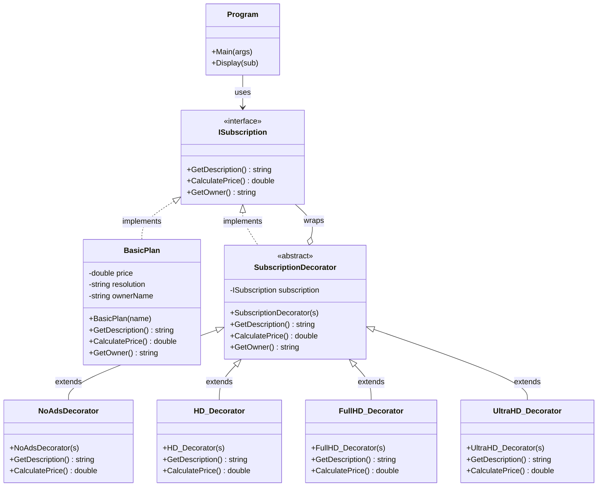

# Decorator Pattern - Streaming Subscription System

## Overview
This project demonstrates the Decorator Pattern with a streaming subscription system.
The pattern adds features (HD, Full HD, Ultra HD, No Ads) dynamically without changing the base class.

---

## Class Diagram



---

## Decorator Pattern Components

### 1) Component
- ISubscription (interface)
  - Defines the common contract: GetDescription, CalculatePrice, GetOwner.

### 2) Concrete Component
- BasicPlan
  - Base subscription with a default price and resolution.

### 3) Decorator (Base)
- SubscriptionDecorator
  - Holds a reference to ISubscription and forwards calls.

### 4) Concrete Decorators
- NoAdsDecorator: adds no-ads feature and extra cost.
- HD_Decorator: adds HD feature and extra cost.
- FullHD_Decorator: adds Full HD feature and extra cost.
- UltraHD_Decorator: adds 4K feature and extra cost.

### 5) Client
- Program
  - Composes subscriptions at runtime by wrapping decorators.

---

## Why This Is Correct Decorator Usage
- Features are added by wrapping, not by subclass explosion.
- Each decorator preserves the ISubscription interface.
- Combinations are created dynamically (order and selection are flexible).

---

## Example Usage

```csharp
ISubscription basePlan = new BasicPlan("Narathip");
ISubscription planWithHD = new HD_Decorator(basePlan);
ISubscription hdNoAdsPlan = new NoAdsDecorator(planWithHD);
```

```csharp
ISubscription premiumPlan = new UltraHD_Decorator(
	new NoAdsDecorator(new BasicPlan("Somsak"))
);
```
